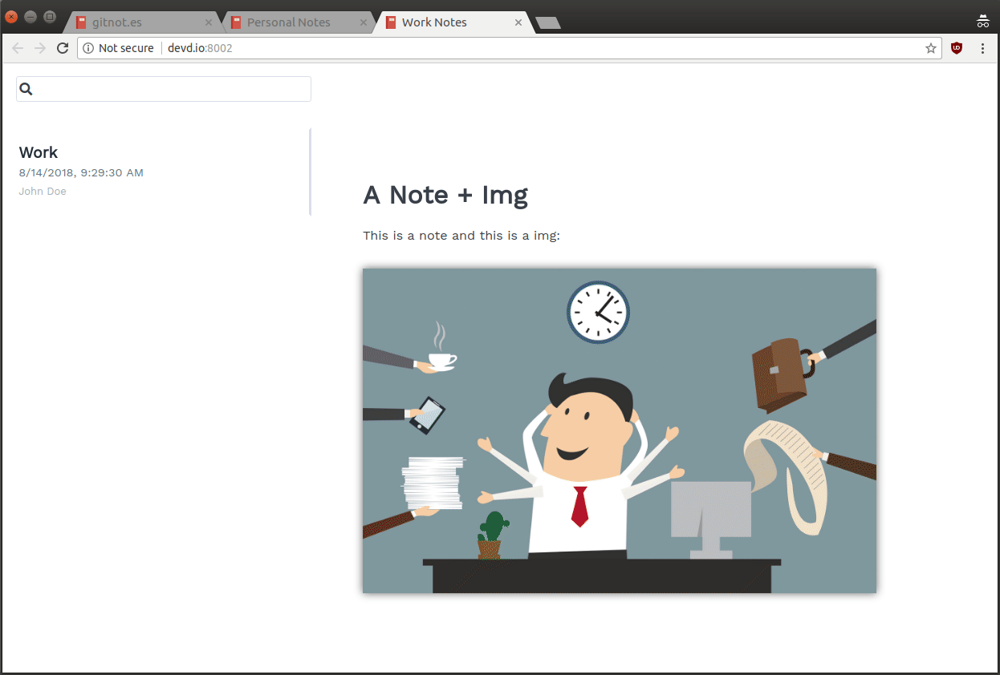

# About

npmnotes is a command line note organizer.

## How it works?

You take your notes with your favorite text editor (currently only .md files are supported) and synchronize them with your favorite synchronization service (a git repository is a good choice).
npmnotes takes your notes and convert them into a web app that you can make public or use locally (just like the one you are at right now).

